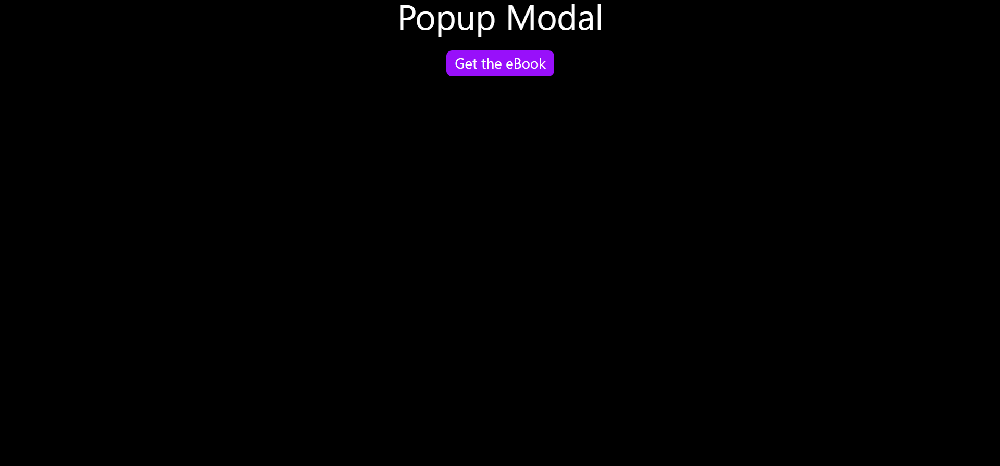
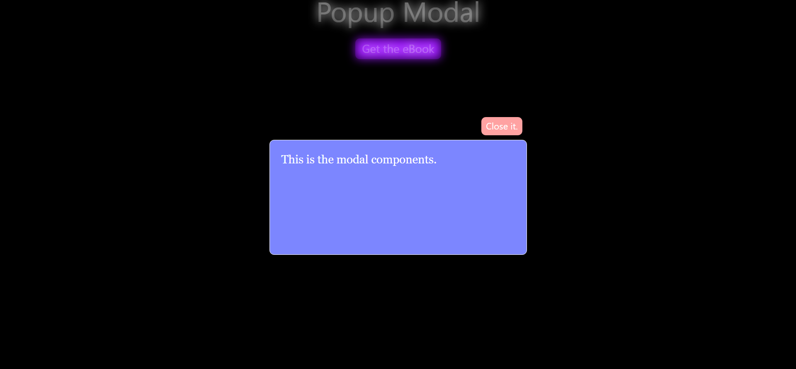
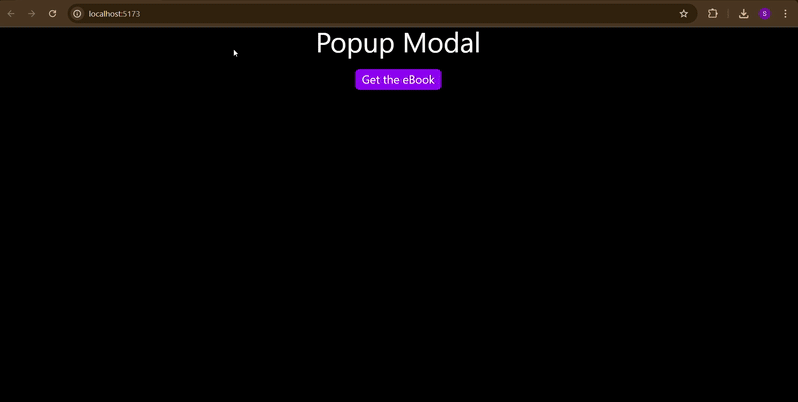

# 📌 React Modal Component

A simple and reusable modal (popup) component built with **React + TypeScript + TailwindCSS**.  
It demonstrates how to open and close a modal using React state. It blurs the background and add opacity to the background for better visual.

---

## Features

- Controlled modal using `isOpen` prop
- Close modal with a button
- Styled with TailwindCSS
- Reusable component design
- Written in TypeScript for better type safety

## screenShots

Here’s how the modal looks in action:

Or as an animated demo:

